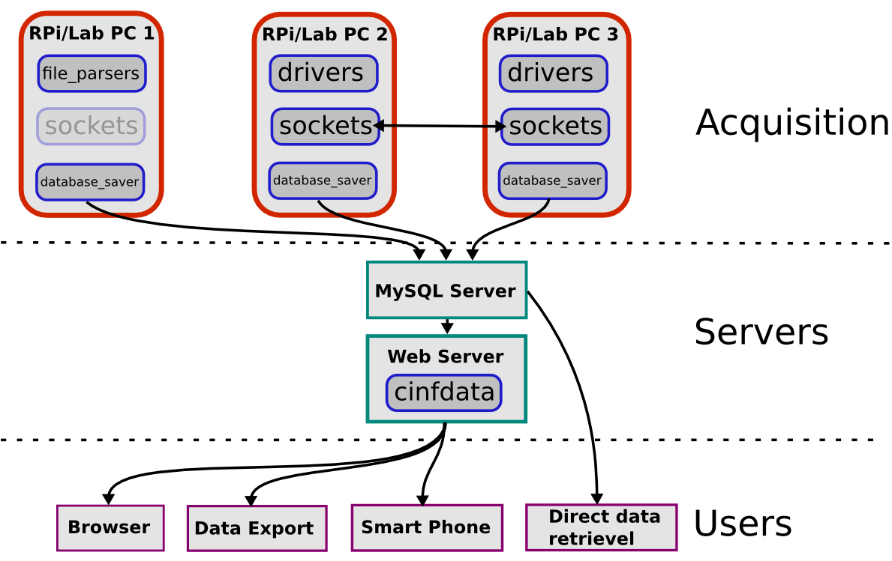

********
Overview
********

This page contains different overviews of the PyExpLabSys archive and
can work as an entry point for a new user.

Section :ref:`project_overview` contains a short explanation of the
different components that PyExpLabSys consist of and the source code
and documentation entries that are relevant for that part.

The table in section :ref:`module_overview` contains an overview of
all the modules in PyExpLabSys. The overview consist of a short
description (the first line of the module docstring) and its Python
2/3 support status.

PyExpLabSys strive to support Python version 2.7 and >=3.3. See the section
:ref:`py3_support` about Python 3 support.

.. _project_overview:

Project Overview
================

This section will explain how the different components of PyExpLabSys
(and its sister project cinfdata) fits together.

.. _overview_figure:

   Figure illustrating how the different software components (boxes
   with blue edge) of PyExpLabSys (and cinfdata) fits together.

The overall structure is illustrated in the :ref:`overview figure
<overview_figure>`. On the aquisition level, there is a number of
machines which could be e.g. Raspberry Pi's or laboratory PC's, which
will use different parts of PyExpLabSys depending on its purpose.

Machine 1 e.g. is used to parse already aquired data from local data
files (:ref:`overview_file_parsers`) and send that data to the
database (:ref:`overview_database_savers`). Machine 2 aquires data via
an equipment drivers (:ref:`overview_drivers`) and makes it available
to other machines on the network (:ref:`overview_sockets`) and uploads
it to the database (:ref:`overview_database_savers`). Like machine 2,
machine 3 also aquires data directly (:ref:`overview_drivers`), but it
also makes use of the data that machine 2 makes available
(:ref:`overview_sockets`).

On the server level there is a MySQL servers to which all data is
saved and a webserver. The webserver runs a webpage called "Cinfdata"
(`source code <https://github.com/CINF/cinfdata>`_), which is used for
data presentation and light data treatment.

On the user level, users will commonly access the data via the
Cinfdata website in a browser on the desktop or on a smart phone. To
get the data locally to do more extensive data treament, it is
possible to fetch the data directly from MySQL server or to use an
export function on the website.

In the following, each of these software components will be described
in a little more detail.

.. _overview_drivers:

Drivers
-------

At this point PyExpLabSys contains a reasonable amount of drivers (46
files, 81 classes May-16) for general purpose equipment (data cards,
temperature readout etc.) and for equipment related specifically to
the vacuum lab we work in (pressure gauge controllers, mass
spectrometers etc).

The source code for the drivers are in the `drivers
<https://github.com/CINF/PyExpLabSys/tree/master/PyExpLabSys/drivers>`_
folder, in which the file names are either manufacturer and model or
just the manufacturer.

The documentation for the drivers are divided into two sections
:ref:`drivers` and :ref:`drivers_autogen_only`. The latter is the
group for which there is only API documentation auto generated from
the source code and the former are the drivers that has more specific
documentation with example usage etc.

.. _overview_file_parsers:

File parsers
------------

PyExpLabSys also contains a small number of parsers for custom file
formats. The source code for these are in the `file_parsers
<https://github.com/CINF/PyExpLabSys/tree/master/PyExpLabSys/file_parsers>`_
folder and the documentation is in the :ref:`file-parsers` section.

.. _overview_database_savers:

Database Savers
---------------

The database savers are some of the more frequently used classes in
PyExpLabSys. Quite simply, they abstract away; the database layout, the
SQL and the queuing of data ofloading (to prevent loosing data in the
event of data loss). The source code for the database savers are in
`database_saver
<https://github.com/CINF/PyExpLabSys/blob/master/PyExpLabSys/common/database_saver.py>`_
module in the `common
<https://github.com/CINF/PyExpLabSys/tree/master/PyExpLabSys/common>`_
sub-package. The documentation is located at
:ref:`common-doc-database_saver`.

.. _overview_sockets:

Sockets
-------

The sockets are another set of very important and highly used classes
in PyExpLabSys. Most of the sockets are socket servers, which mean
that they accept UDP requests and serves (or accepts) data. These are
essentially used as network variables, by either exposing a
measurement on the network or accepting input. A final type of socket
is the LiveSocket which is used to live stream data to a live
streaming proxy server. Furthermore, all sockets also expose system
(health) information to the network. The code for the sockets are
found in the `sockets
<https://github.com/CINF/PyExpLabSys/blob/master/PyExpLabSys/common/sockets.py>`_
module in the `common
<https://github.com/CINF/PyExpLabSys/tree/master/PyExpLabSys/common>`_
sub-package. The documentation is located at
:ref:`common-doc-sockets`.

Apps
----

The apps section contains stand alone programs which can be used directly
and not only as service functions of larger programs. Typically the apps
sports text based guis and several apps also have ambitions for graphical
guis.
Notable examples of apps are:
`socket supervisor
<https://github.com/CINF/PyExpLabSys/blob/master/PyExpLabSys/apps/socket_supervisor.py>`_
This very simple app continously probes a port (typically a `socket
<https://github.com/CINF/PyExpLabSys/blob/master/PyExpLabSys/common/sockets.py>`_)
and reports back if the socket is running correctly.

`Mass Spectrometer
<https://github.com/CINF/PyExpLabSys/tree/master/PyExpLabSys/apps/qms>`_
Controls a number of Pfeiffer mass spectrometers. The app includes support
for an infinite amount of meta-channels wich is pulled in via sockets.

`Picture Logbook
<https://github.com/CINF/PyExpLabSys/blob/master/PyExpLabSys/apps/picture_logbook.py>`_
A graphical logbook system based on a barcode reader and a camera. The user of the
equipment logs in before use and out after use. A picture of the equipment is acquired
at login and logout. Also contains support for an external screen wich shows the currently
logged in user.

`Turbo pump controler
<https://github.com/CINF/PyExpLabSys/blob/master/PyExpLabSys/apps/turbo_logger.py>`_
Logs and controls Pfeiffer turbo pumps. A number of important parameters are shown
in a terminal and the values are also availble as live sockets.

Misc.
-----

Besides from the items listed above PyExpLabSys contains a number of
little helpers. The :py:mod:`PyExpLabSys.common.utilities` (`code
<https://github.com/CINF/PyExpLabSys/blob/master/PyExpLabSys/common/utilities.py>`_,
:ref:`doc <common-doc-utilities>`) module contains a convenience
function to get a logger, that is configured that way that we prefer,
including email notification of anything warning level or above.

.. _py3_support:

Python 3 support
================

**We love Python 3**. Unfortunately we are not hired to make software, but to keep a lab
running. This means that modules are only ported to Python 3, when it is either convinient or
we are touching the code anyway.

.. _module_overview:

Module Overview
===============

.. include:: py3_stat.inc

.. rubric:: Footnotes

.. [#inferred] For these modules the Python 2/3 status is not
	       indicated directly in the source code file and so the
	       status is inferred.
